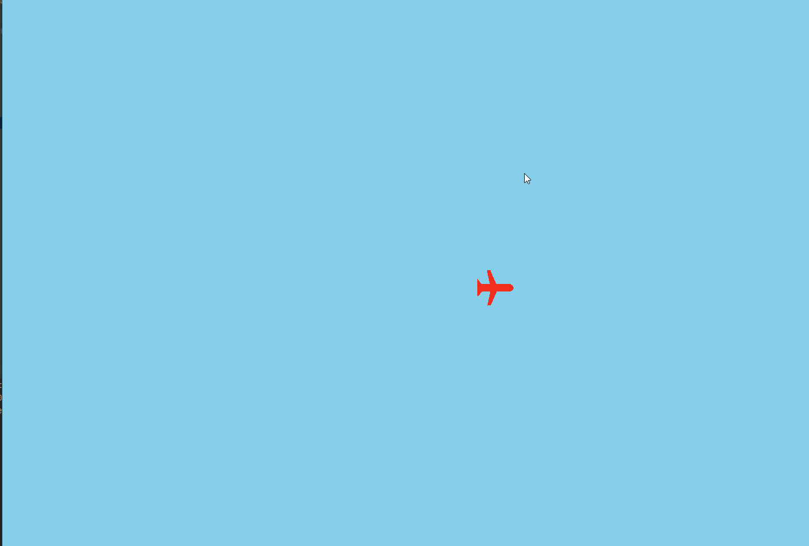

# Aeroplane Game

## Summary
The aim of the game is to dodge the missiles as an aeroplane.

I created this game as a fun project to learn about GUIs and use interesting equations and algorithms.

## Features
 - Missiles use a Djikstra pathfinding algorithm to chase the plane
 - The plane slows down as it turns, and speeds up when straight
 - Collision detection ends the game
 - Missiles spawn as the game goes on to increase the difficulty

## How To Play
 - Clone the repository
 - Run `pip install -r requirements.txt`
 - Run `python Aeroplane.py`

## Upcoming Features
 - Ending Screen (Score is currently displayed in the console)
 - Difficulty levels
 - Giving the aeroplane defense, such as guns or shields
 - More varied enemies, such as other planes with guns
